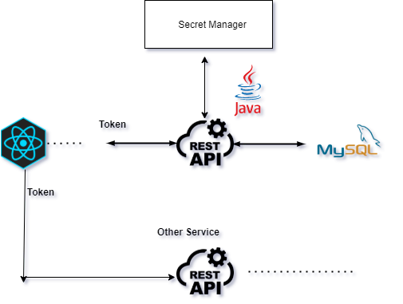

### User Service Authentication Spring Boot


This is a simple api service authentication in spring boot.
The main responsibility is to verify the user request login data 
and if the response is positive return a jwt token.

The input request would come from a front end page which would have to be created in 
another service. The frontend would receive the token and would then be routed
to the desired other services.

This token would be then used by other services for their specific tasks.

The private key is a google cloud authentication key and for now it is hardcoded in
the application.properties file in the src/main/resources folder

 

| Endpoint    | Type | Auth? | Description |
| ------------|:----:| -----:|:-------------:|
| /login      | GET  |       |Returns a JWT if authentication is successful
| /users      | POST |       |Validates and creates a new user record.


### TODO
- The idea is to deploy this application in google kubernetes engines and from there
to access the key from the google cloud secret manager.
- Configure the application.properties to utilize the cloud-sql instead of 
the local mysql




```
 POST api/auth/signin
               
              post(userModel,password) 
 CLIENT ----------------------------> AuthService Authenticate(userModel,password) -> JWTToken
          
              response  token jwt
              (userModel info, type,authorities...)
 CLIENT <---------------------------- AuthService
 
 
 AuthService: 
 
       Authenticate(userModel,password)
       
       
 ```

- Download and install MySql (Workbench)
  
- Create a schema in mysql
  
- Modify the parameters in the src/main/resources/application.properties

user-service.token-expiry-seconds=6000
user-service.private-key=<PRIVATE_KEY>
spring.datasource.url=jdbc:mysql://localhost:3306/<NAME_SCHEMA_DB>
spring.datasource.username=USERNAME
spring.datasource.password=PASSWORD

When the application starts src/main/resources/data.sql and schema.sql are
responsible for creating a table with some test values


